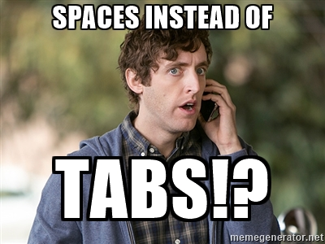

## What are all those files?!
Frontend solutions in 2023 are not simple. Root directories are riddled with config files, and other dot files that seem to be black magic. In most cases, developers don't need to think much about what these do - they maybe have been placed there by your Tech Lead or came with a starter repo. It's important to understand them and their purpose.

In some cases, solutions may be _missing_ some of these tools which can lead to inconsistencies in code style or promote bad patterns.

## Editorconfig



EditorConfig helps maintain consistent coding styles for multiple developers working on the same project across various editors and IDEs. Most of the time, these address definition for the anatomy of a file. Spaces or Tabs? LF or CRLF? It does __not format__ your code; it provides a set of rules for your Editor/IDE to follow

```
root = true

[*]
end_of_line = lf
indent_style = space
indent_size = 2
charset = utf-8
trim_trailing_whitespace = true
insert_final_newline = true
```


## Prettier

Prettier is a code formatting tool that focuses exclusively on the visual appearance of your code. It enforces a consistent style for your code by automatically formatting it according to predefined rules. Prettier is opinionated and aims to eliminate debates over coding style within a team. It can format code for various languages, including JavaScript, HTML, CSS, and more. Prettier's main goal is to make your code look consistent and professional without much manual effort. Prettier should "just work" and it enables your team to not think about style -- this can save time during development and during the Code Review Process.

Prettier is awesome. I overlooked Code Formatting for far too many years of my career, and I have ragrets.


## ESLint

ESLint is a linting tool that goes beyond code formatting. It helps you find and fix issues in your code related to coding standards, potential bugs, and best practices. ESLint uses a set of configurable rules to analyze your code and report any violations. Unlike Prettier, ESLint's focus is not just on visual formatting but also on identifying problematic patterns and potential errors in your code. It's primary function in projects already using Prettier is to help enforce code quality rules by statically analyzing code from within your IDE. Notice those red squigglies? That is most likely ESLint helping you out. ESLint is a powerful tool with a large ecosystem of plugins to plug-n-play with various frameworks/libraries. For example:

* [Tailwind](https://www.npmjs.com/package/eslint-plugin-tailwindcss)
* [React](https://www.npmjs.com/package/eslint-plugin-react)
* [Angular]

Plugins and ESLint rules are configured via a ESLint config 
* .eslintrc
* .eslint.json
* .eslint.js

Look for these in projects you are working in and familiarize yourself with the plugins / configuration.

## Summary
The TL;DR
* .editorconfig provides project-wide settings for code editors and IDEs.
* Prettier offers automated, opinionated code formatting.
* ESLint focuses on code quality and can be configured to enforce coding style rules.


