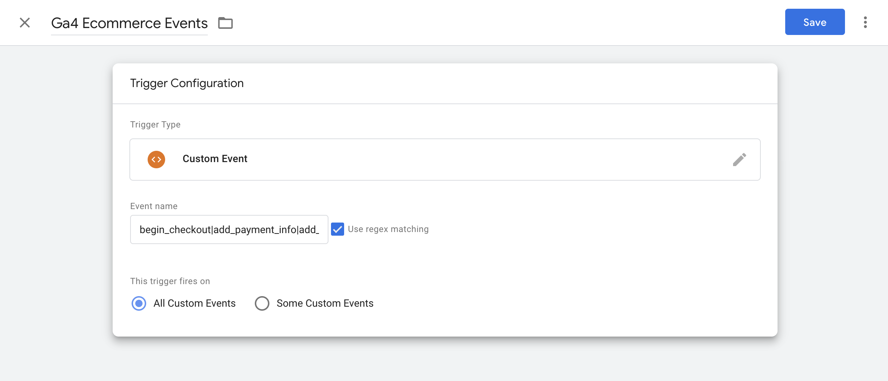
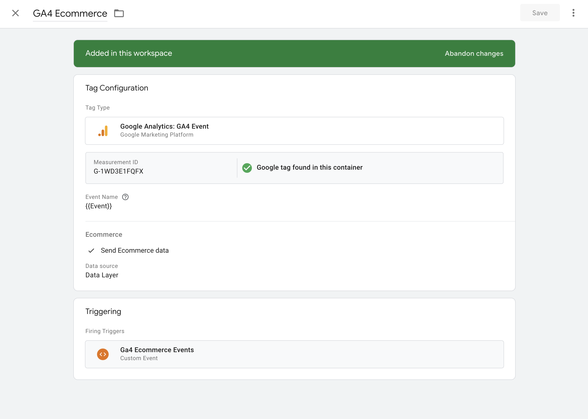
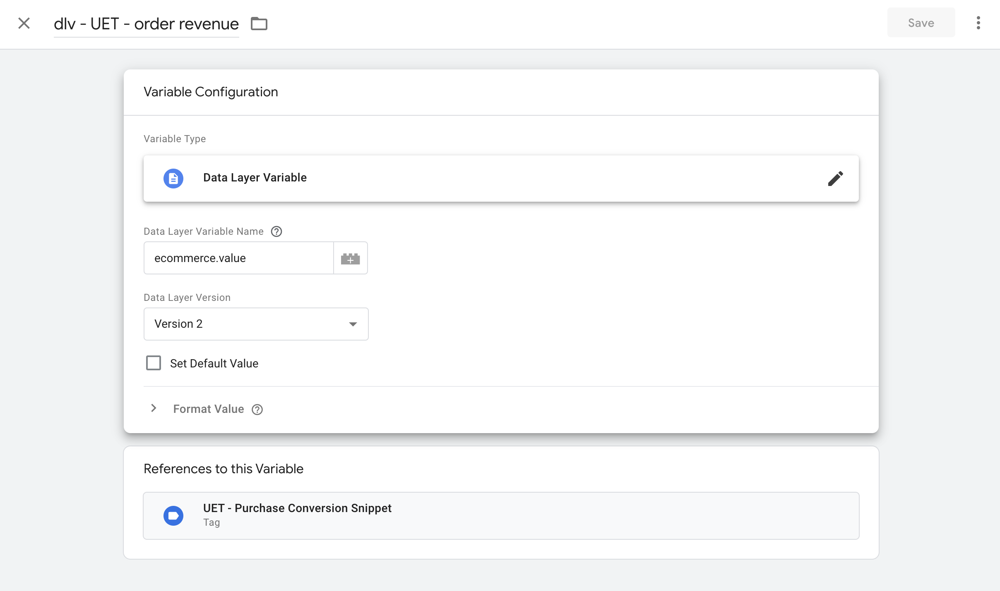
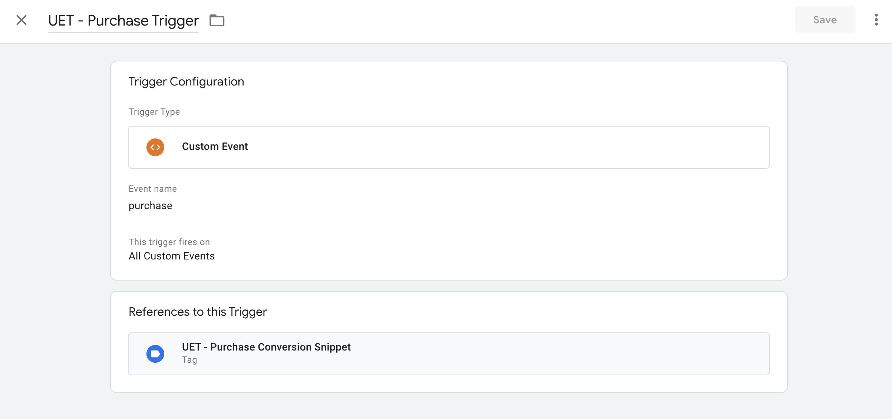
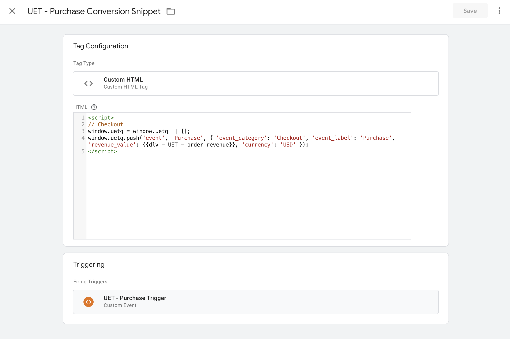

## GTM vs GA
I feel it is important begin by calling out the distinction between Google Tag Manager and Google Analytics. While the two can be used completely separately, you typically will see them joined in the hip for Analytics implementations.

**Google Tag Manager (GTM)**

In the context of Google Tag Manager (GTM), a "tag" refers to a snippet of code deployed to a website with the purpose of collecting data to send to various third party systems. GTM enables managing and deploying tags without requiring changes to source code. In fact, you typically see a tag for Google Analtyics (GA) included in a GTM implementation.

**Google Analytics (GA)**

Google Analytics role is to gather and analyze data. Typically GTM will facilitate getting GA Tags to a website and bringing in the necessary scripts to pass data to GA via the [Google tag API](https://developers.google.com/tag-platform/gtagjs/reference).


## Understanding the Data Layer
To put it simply, the Data Layer is nothing more than an array. You can access the Data Layer at anytime by opening your dev tools and entering `window.dataLayer` into the console. Assuming the website utilizes GTM, you will see an array of various objects representing various things. Implementing the data layer is as simple as pushing new values into that array.

The Data Layer serves as a bridge between your website and various analytics and tracking tools, with Google Tag Manager playing Quarterback. It acts as a container for crucial information about user interactions, page details, and other custom data points, allowing you to collect the information and pass it to various systems.

It is important to understand a few basic terms & concepts involved with a Data Layer implementation.

- __Variables__ are named placeholders you can use for dynamic values populated at runtime. You can use Variables from within Triggers and directly within Tags to capture values.
- __Events__ represent interactions or occurrences on your website. These range from standard events like page views to eCommerce events like submitting an order.

When events occur or variables are updated within the data layer (via `dataLayer.push`), this triggers appropriate tags in GTM to collect and process the data. What triggers fire depends on what is pushed to the Data Layer.


## Implementing ecommerce Analytics
[Google has pretty decent documentation](https://developers.google.com/analytics/devguides/collection/ga4/ecommerce?client_type=gtm) highlighting what events are expected in a typical ecommerce implementation. While this can be done completely from within GTM using Tags, I think a good implementation should be implemented by developers and live in the main code repository for your project. Sometimes these events occur at weird times and as a Developer, I want complete control over when and what is passed to the data layer.

If you're smart, you can write this in simple TS/JS to re-use across your projects. Below, I have demonstrated a simple Typescript class with a method used for tracking [Add to Cart](https://developers.google.com/analytics/devguides/collection/ga4/ecommerce?client_type=gtm#add_or_remove_an_item_from_a_shopping_cart) events.

```ts
export class DataLayer {

  // Checks to ensure data layer exists. Use this before attempting to push to it
  private static _isDataLayer = (): boolean {
    return !!window.dataLayer
  }

  public static AddToCart = (item, quantity): void => {
    if(!this.dataLayer()) return

    const event = {
      event: 'add_to_cart',
      ecommerce: {
        items: [
            item_id: item.sku,
            currency: item.price,
            item_name: item.name,
            item_list_name: listName,
            item_list_id: listName,
            price: item.price.value,
            variantId: variantId,
            quantity: quantity,
        ]
      }
    }

    window.dataLayer.push(event)
  }
}

```

Usage inside a button click handler.

```js
const onAddToCart = (item, quantity) => {
  ...

  // Call the Add To Cart Event
  DataLayer.AddToCart(item, quantity)
}

return (
  <Button onClick={() => onAddToCart(item, quantity)}
)

```

### GTM eCommerce Setup
Alright, time for the not fun part. If you work with marketers who do not know how to use GTM, you may be on the hook for doing the setup within GTM for handling what happens when eCommerce events are pushed to the Data Layer. This is the work to configure a trigger that performs work when specific events happen.

__The following assumes access to GTM for the property you are working in__
**Trigger Configuration**

1. Create a new Trigger. This trigger will fire upon all eCommerce events. I like to call this "GA4 Ecommerce Events".
  - Select "Custom Event" for Trigger Type
  - Event name can use regex matching. This allows you to specify multiple event names for the Trigger to fire on.
    - `add_to_cart|remove_from_cart|apply_promotion_code|view_cart|login|sign_up|view_item|begin_checkout|add_payment_info|add_shipping_info|purchase`
    - Set Trigger to fire on All Custom events
    - Save Changes




**Tag Configuration**

1. Create a new Tag. I like to title this "GA4 Ecommerce"
  - Under Tag Configuration select "Google Analytics: GA4 Event". This tells the Tag the data must be sent to the GA Container referenced in the config via the Measurement ID.
  - Set event name to `{{Event}}`
  - Ensure to toggle "Send Ecommerce Data" from under "More Settings". Keep the data source set to "Data Layer"
  - Select the Trigger you made in the previous step as the Trigger
  - Save Changes




Once you save all changes and submit the changes to your workspace, the trigger and tags should be ready to roll.

You may be asking, well what does the end result actually do? How do my events reach Google Analytics? Do they get sent from Tag Manager then flow into Google Analytics? NO. They actually get sent directly from the browser to Google Analytics via the gtag api. The Tag you created above handles that for you. When events are passed into the data layer, the __Google Analytics GA4 Event__ tag handles the work of making an API call for you. You can see this in action within your Dev Tools Network tab after you push events that satisfy the Trigger to the data layer.

## Use with other Analytics tools
We can leverage the existing Data Layer events we've implemented for additional Analytics tools without any additional code changes. For example, Marketing may want to send Order Revenue to Pixel or Microsoft UET.

We can achieve this by creating a custom User-Defined Variable and then referencing that Variable from a new Tag. This new User-Defined Variable will have its value set to the `value` field on an ecommerce event which represents order total.

**1. Create a new Variable.**
  - Set variable type to "Data Layer Variable"
  - Set Data Layer Variable Name to "ecommerce.value"
    - You can use dot notation against objects that are expected to exist in the data layer
  - Save Changes

```json
{
  "event": "purchase",
  "ecommerce": {
    value: "15.69",
    items: []
  }
}

```




**2. Create a new Trigger**
 - Create a trigger to fire on the event you want to track. In this example, we are going to create a trigger which fires when the "purchase" ecommerce event lands in the data layer.
 - Set Trigger type to "Custom Event"
 - Set Event Name to "purchase"
 - Ensure this trigger fires on all custom events.
 - Save Changes





**3. Create a new Tag to send Conversion to Third Party Analytics**
  - Set tag type to "Custom HTML"
  - Paste script in the HTML editor. Below is an example using UET to push a purchase event
  - Set the Trigger to the new Trigger created from the previous step. When this trigger fires, the snippet will be executed on the website.
  - Save Changes

The main thing to notice here is how we are able to reference our User-Defined Variable directly from this script by using the double curly notation `{{ }}`. This allows us to have dynamic variables in our Tags and share values like Order Revenue across many different tags.

```html
<script>
// Checkout
window.uetq = window.uetq || [];
window.uetq.push('event', 'Purchase', { 'event_category': 'Checkout', 'event_label': 'Purchase', 'revenue_value': {{dlv - UET - order revenue}}, 'currency': 'USD' });
</script>
```




## Conclusion
Working at a Consulting Agency you may find yourself responsible to be the GTM expert. I'm hoping this post helps shed some light on how the Data Layer works with Varaibles, Tags, and how you can get a basic implementation working.
